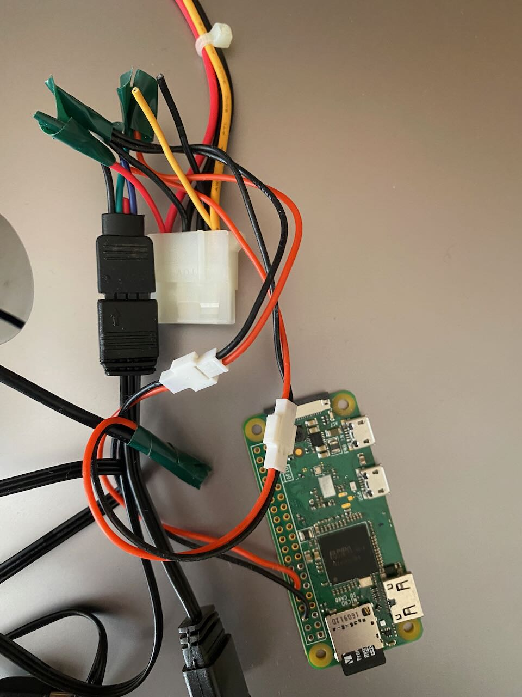
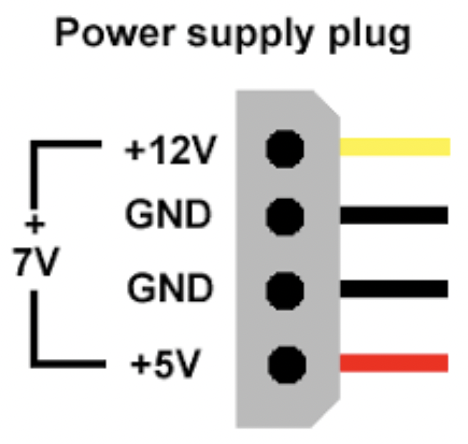
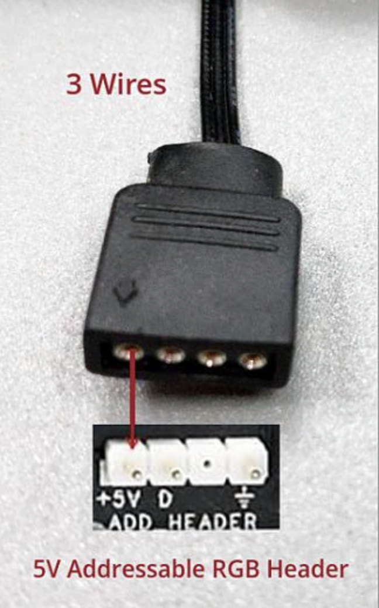
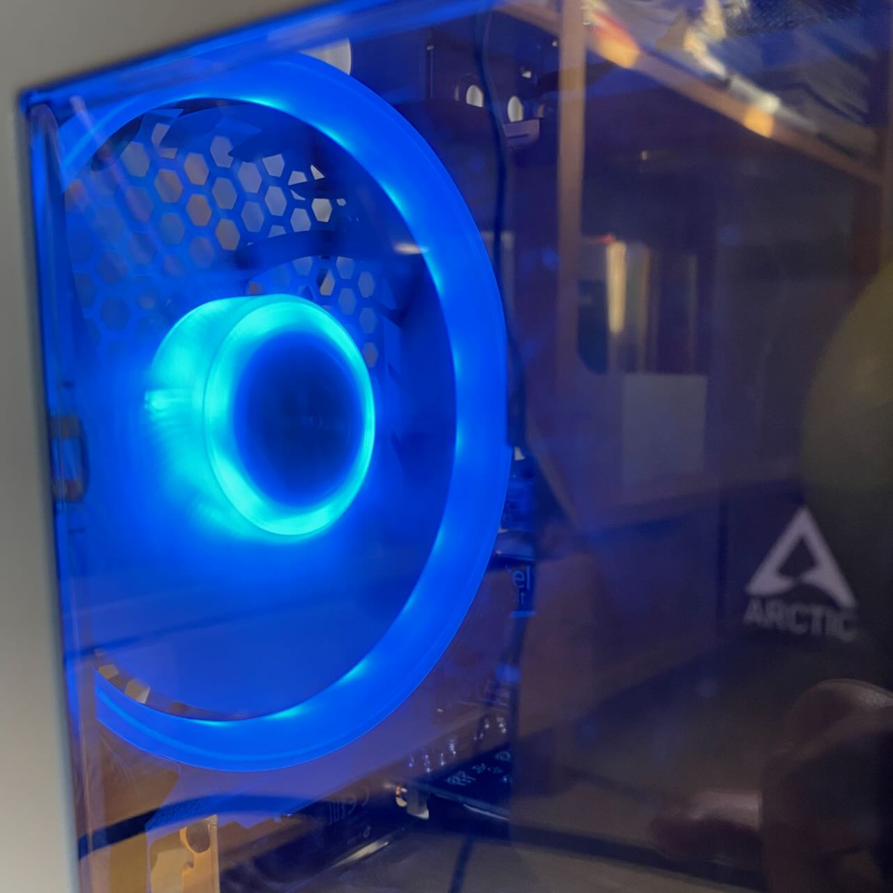

# Glucoled

Silly hack project that loads glucose data from Nightscout and changes the color of a LED fan inside a computer accordingly.

You should be able to use addressible LED fan to build this. ARGB leds use 5 volts and have a three-pin connector, where one pin is +5V, one is ground and one is a data pin used to send the color data to the LEDs digitally (vs the older 12 volt LEDs that have four pins, ground and a voltage pin for each color).

Running the script:

`sudo nodejs glucoled.js nightscouthost.herokuapp.com`
 
* Uses https://www.npmjs.com/package/rpi-ws281x to as the LED driver for Node
* For wiring, see https://tutorials-raspberrypi.com/connect-control-raspberry-pi-ws2812-rgb-led-strips/
* How to run the script at boot https://raspberrypi-guide.github.io/programming/run-script-on-boot

IF wiring inside a computer, soldering a custom cable is relatively simple. Standard computer power supply units output 12 and 5 volt currencies and both the Pi and fans use 5 volts. I had a Molex fan adapter cable handly, so adapter the instructions from the above link and used the red/black wires from the Molex as the power supply. Pi expects to be powered from the USB port, so this adapter included a micro-USB cable soldered to the same 5 volts.

